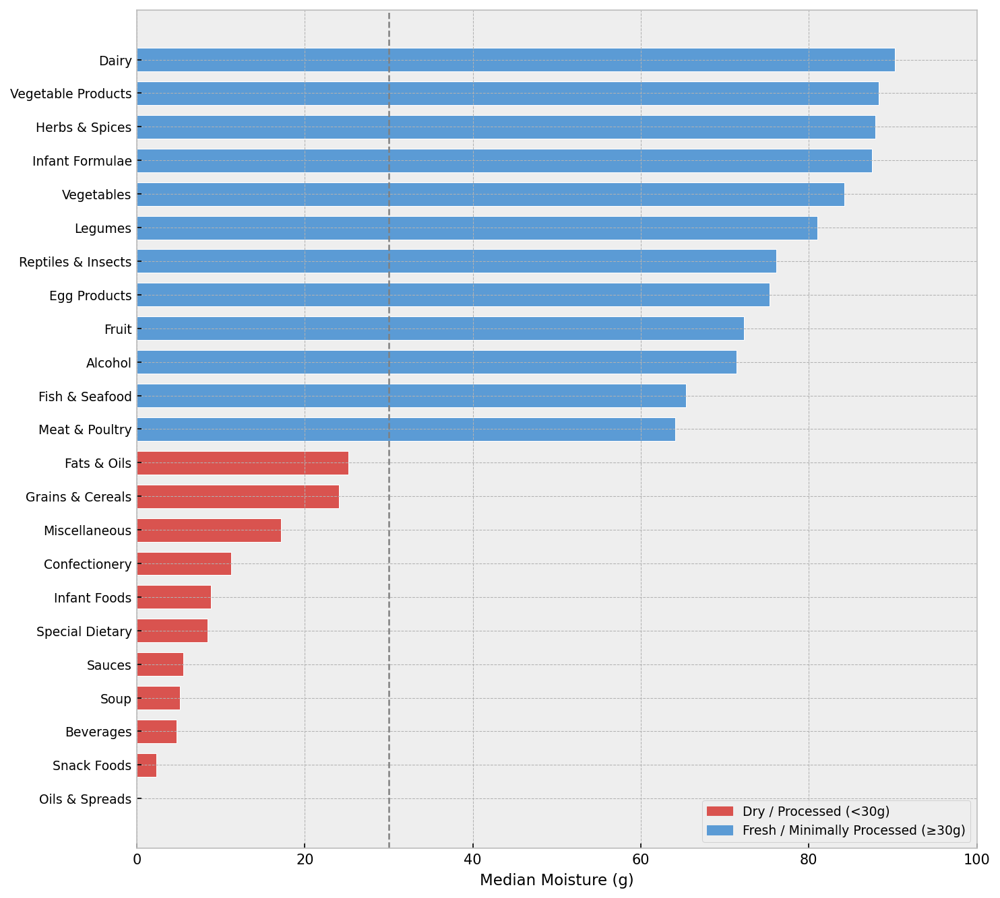
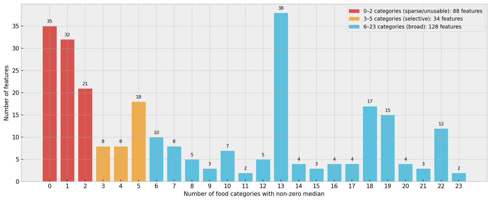
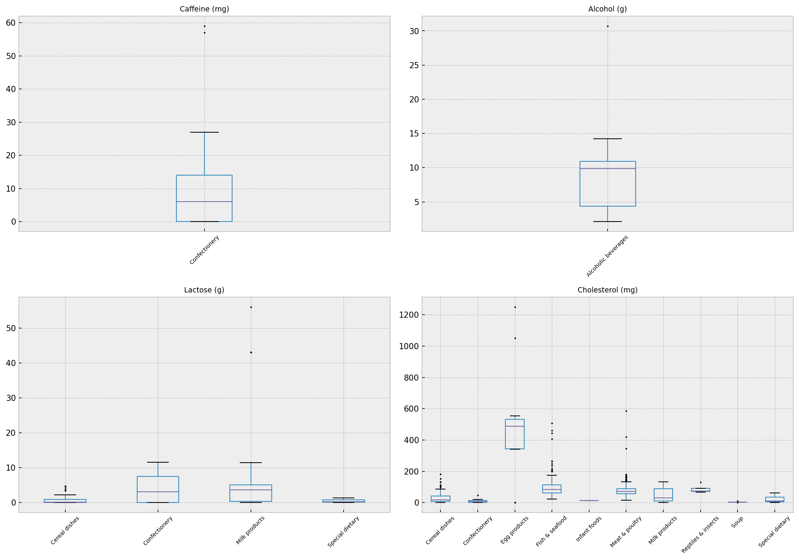
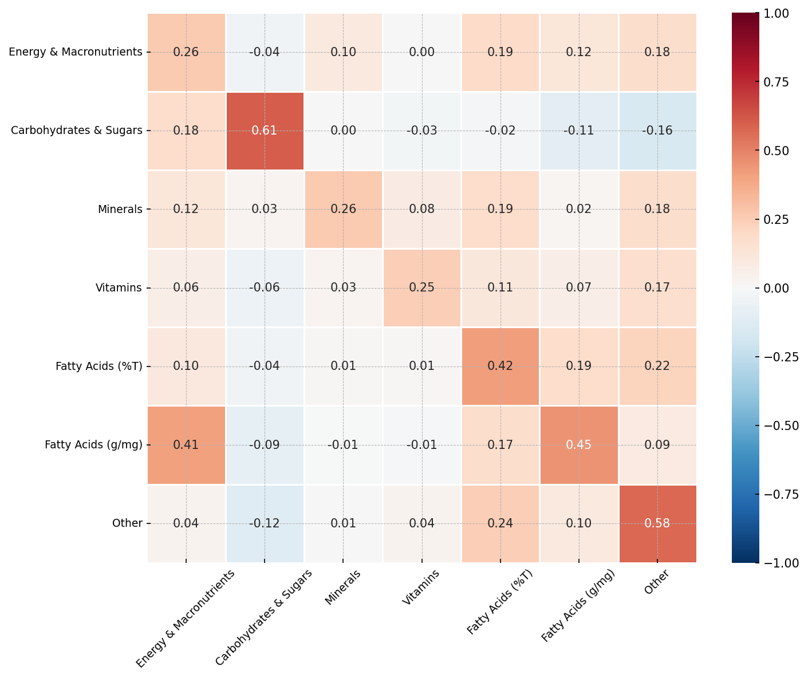
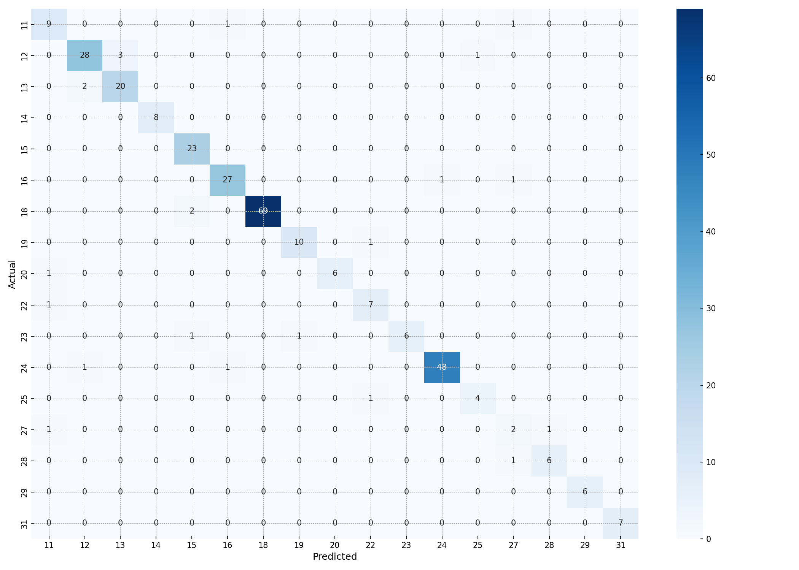
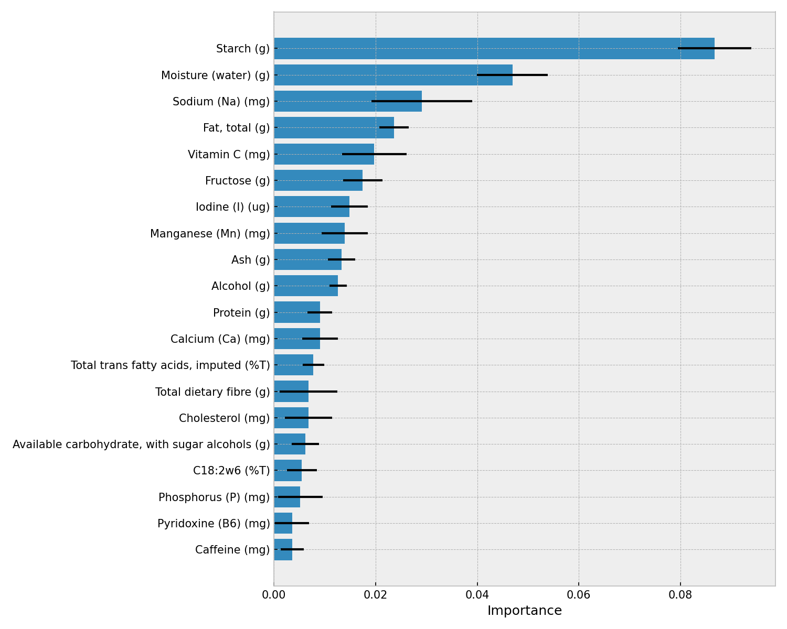

# Nutrient Profiles Analysis: Food Group Classification

A machine learning pipeline that classifies foods into 23 major food groups (AUSNUT 2023 taxonomy) using only their nutrient composition and measurements.

View the notebook
[here.](food-group-classification.ipynb)

## Highlights

- **92.6% test accuracy** / **0.88 macro F1** with a tuned Gradient Boosted Trees model on 17-class food group classification
- Diagnosed and solved a **288-feature → 80-feature** dimensionality problem (23 constant features removed, 165 dropped for >30% missingness) while preserving predictive signal
- Identified that the feature space is **largely linearly separable**, as a regularized Logistic Regression baseline reaches 90.6% test accuracy, and that non-linear ensembles provide real but incremental gains concentrated in nutritionally ambiguous categories
- Applied a three-stage **SMOTE → undersampling → Tomek Links** pipeline to correct severe class imbalance (raw class counts ranged 22–354; post-resampling, 41–185)
- Used **EM-based iterative imputation** to fill missing nutrient values rather than naive mean/median imputation, justified by the strong inter-nutrient correlation structure uncovered in EDA
- Traced model decisions back to nutrition science: alcohol, cholesterol, and moisture content emerged as near-exclusive, biologically interpretable identifiers for specific food groups

## Problem

The Australian Food Composition Database (AFCD 3) contains 1,588 food items and 268 nutrient fields, each food labelled with a 6-digit AUSNUT classification code. This project asks:

- Can major food groups be accurately recovered from nutrient profiles alone, despite class imbalance, high dimensionality, and extensive missingness?
- Which nutrients are most predictive of food group membership, and do they align with nutritional intuition?
- Which food groups are hardest to separate, and why?
- Is the problem linearly separable, or does it require non-linear models?
- Does added model complexity actually pay off given the limited sample size (1,588 rows)?

## Dataset

- **Source:** AFCD 3 / AUSNUT 2023, sheet `"All solids & liquids per 100 g"`
- **Target:** `class_2digit`, the first two digits of the `Classification` code, representing 23 major food groups (Dairy, Meat & Poultry, Fish & Seafood, Fruit, Vegetables, Grains & Cereals, Alcohol, etc.)
- **Class imbalance:** Meat & Poultry (n=354) and Vegetable Products (n=249) together made up ~40% of samples; 6 classes had fewer than 15 samples and were dropped, leaving **17 classes** for modelling.
- **Split:** Stratified 80/20 → **1,235 training / 309 test** samples.

## Methodology

### 1. Exploratory Data Analysis
- Univariate distribution analysis across all 268 numeric features, flagging skew, zero-inflation, and missingness.
- **Moisture content** proved a strong single discriminator: dry/processed foods (fats & oils, snacks, confectionery) cluster near 0g, fresh/minimally-processed foods (meat, fish, vegetables, dairy) cluster at 64–90g.

  
  *Median moisture content across food categories, showing a clear split between dry/processed and fresh/minimally-processed groups.*

- **Feature prevalence analysis**: 35/268 features were zero across *every* category (no signal), 53 more were non-zero in only 1–2 categories, and 128 features spanned 6+ categories. A cluster of 38 features non-zero in exactly 13 categories aligned precisely with the protein-containing food groups in the dataset.

  
  *Number of food categories in which each feature is non-zero; 88 features are candidates for removal.*

- **Nutrient exclusivity deep-dive** on alcohol, caffeine, lactose, and cholesterol showed each is a near-perfect signal for a specific category (e.g. alcohol → alcoholic beverages, cholesterol → egg products, median ~450mg), directly informing feature importance expectations before any model was trained.

  
  *Boxplots of alcohol, caffeine, lactose, and cholesterol showing near-exclusive concentration in single food categories.*

- **Group-level correlation analysis** revealed strong within-group redundancy (motivating regularization) and a meaningful negative correlation between carbohydrates and fatty acids (motivating linear-model viability).

  
  *Mean correlation between engineered feature groups (macronutrients, minerals, vitamins, fatty acids).*

### 2. Preprocessing (268 → 80 features)
| Step | Effect |
|---|---|
| Drop constant features | 268 → 245 |
| Drop features with >30% missingness | 245 → 80 |
| Log1p transform on skew > 2.0 | 66 features transformed |
| EM imputation (`IterativeImputer`, max_iter=10) on remaining nulls | 20 features imputed, negatives clipped to 0 |
| Drop classes with <15 samples | 23 → 17 classes |

### 3. Resampling & Scaling (train set only, to avoid leakage)
1. **SMOTE** oversamples any class below 50 samples (k=5 neighbours)
2. **RandomUnderSampler** caps any class above 200 samples
3. **TomekLinks** removes borderline synthetic samples at class boundaries
4. **StandardScaler** fits on resampled training data, applied unchanged to test data
5. **Stratified 5-fold CV** configured for model selection

### 4. Modelling
Three models were selected deliberately to answer the linearity/complexity questions above:

| Model | Why it was included |
|---|---|
| **Logistic Regression** | Linear baseline; tests whether the problem is linearly separable and gives interpretable coefficients |
| **Random Forest** | Tests whether non-linear, feature-interaction-aware methods beat the linear baseline; yields feature importances |
| **Gradient Boosted Trees** (`HistGradientBoostingClassifier`) | Tests whether sequential error-correction improves on bagging, particularly on imbalanced/overlapping classes |

Hyperparameters were tuned via `RandomizedSearchCV` and cross-checked with **Optuna** (TPE sampler, 50 trials/model).

## Results

| Model | CV Balanced Acc. | Test Accuracy | Macro F1 | Test Balanced Acc. |
|---|---|---|---|---|
| Logistic Regression | **0.929** ± 0.019 | 0.906 | 0.836 | — |
| Random Forest | 0.917 ± 0.015 | 0.920 | 0.860 | — |
| **Gradient Boosted Trees** | 0.913 ± 0.022 | **0.926** | **0.882** | **0.883** |

- All three models exceed **90% test accuracy** despite severe imbalance, high dimensionality, and heavy missingness.
- Notably, **Logistic Regression had the best CV score but the worst test score**, a sign of mild overfitting to the resampled training distribution, and a reminder that CV rank and holdout rank don't always agree.
- **Gradient Boosted Trees was selected as the final model**, winning on every test metric, with the clearest gains concentrated on previously ambiguous classes (e.g. Miscellaneous foods: F1 improved from 0.67 → 0.83 → 1.00 across LR → RF → GB).

  
  *Confusion matrix for the tuned Gradient Boosted Trees model on the held-out test set.*

- Classes with unique nutrient "fingerprints" such as Fats & Oils, Fish & Seafood, Meat & Poultry, Alcoholic Beverages hit F1 = 1.00 across *all three* models, directly confirming the EDA's nutrient-exclusivity findings.
- Feature importance rankings diverged meaningfully between models: Random Forest spread importance evenly across ~20 features (available carbohydrate, alcohol, energy, moisture, fibre), while Gradient Boosting concentrated importance heavily on **starch** (2x the next-ranked feature), followed by moisture and sodium, suggesting that the two algorithms are exploiting the feature space differently even though their headline accuracy is similar.

  
  *Permutation feature importance for the Gradient Boosted Trees model, top 20 features.*

## Key Findings

1. **The problem is largely linearly separable.** A regularized linear model gets to 90.6% accuracy on its own, proving that log-transformation and standardization did most of the heavy lifting before any ensemble method was applied.
2. **Non-linear models earn their complexity, but narrowly.** Random Forest and Gradient Boosting both beat Logistic Regression on every test metric despite lower CV scores, with gains concentrated on a handful of nutritionally overlapping categories (Legumes vs. Vegetables, Miscellaneous vs. Vegetable Products).
3. **A handful of nutrients carry disproportionate signal.** Alcohol, cholesterol, moisture, and starch behave as near-exclusive biomarkers for specific food groups, which generalizes cleanly to nutrition science rather than being a modelling artifact.
4. **Confidence intervals overlap across all three models.** CV score differences between models are not statistically significant; test-set performance is the more reliable comparison axis.

## Limitations & Future Work

- **Resampling leakage risk:** SMOTE/undersampling was applied *before* cross-validation rather than inside each fold, which likely inflated CV estimates and may have biased hyperparameter selection. Fix: wrap resampling inside an `imblearn` pipeline so it's refit per fold.
- **Aggressive missingness threshold:** dropping 165 features at a 30% missing cutoff is conservative and may have discarded informative nutrients whose absence was structural rather than random.
- **Small per-class test sizes:** several minority classes (e.g. class 27, n=4 in test) are too small for reliable per-class F1 estimates.
- **Next steps:** correct the resampling pipeline, explore dimensionality reduction across the correlated nutrient groups identified in EDA, and extend classification to finer-grained (4-digit) food categories.

## Repository / Notebook Structure

| Section | Contents |
|---|---|
| EDA | Distribution plots, skew diagnostics, moisture bimodality, nutrient exclusivity, group correlation heatmap |
| Preprocessing | Constant/high-null column removal, log transforms, EM imputation, class filtering |
| Split & Resampling | Stratified train/test split, SMOTE + undersampling + Tomek pipeline, scaling, K-fold setup |
| Modelling | Logistic Regression, Random Forest, Gradient Boosted Trees, each with `RandomizedSearchCV` and Optuna tuning |
| Evaluation | Cross-validation scores, classification reports, confusion matrices, feature importance |

## Requirements

```bash
pip install pandas openpyxl seaborn matplotlib scikit-learn imbalanced-learn optuna numpy
```

**Dataset**
- Source: https://www.foodstandards.gov.au/science-data/food-nutrient-databases/ausnut
- Direct download: https://www.foodstandards.gov.au/sites/default/files/2025-09/AUSNUT%202023%20-%20Food%20nutrient%20profiles.xlsx?v=20250903

Place `AUSNUT 2023 - Food nutrient profiles.xlsx` (sheet: *"All solids & liquids per 100 g"*) in the working directory, then run the notebook cells sequentially, since later stages depend on DataFrame state produced earlier. The Optuna tuning cells (50 trials × 3 models) and the Random Forest proximity matrix computation are the most compute-intensive steps.

## Outputs

Running the notebook produces the following figures, saved to an `images/` folder referenced throughout this README:

`numeric_distributions.png`, `log_transform_justification.png`, `moisture_raw.png`, `moisture_bimodal.png`, `feature_prevalence.png`, `nutrient_exclusivity.png`, `group_correlation_heatmap.png`, `confusion_matrix_lr.png`, `confusion_matrix_rf.png`, `confusion_matrix_gb.png`, `feature_importance_rf.png`, `feature_importance_gb.png`, `proximity_matrix.png`, `confusion_matrices_tuned.png`